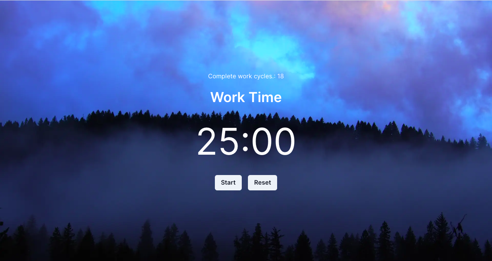

# Pomodoro Timer（Tomato Clock）

## Overview

Very simple pomodoro timer（Tomato Clock） aimed for simplicity and productivity. Built using Next.js and ChakraUI. The project is live [here](https://tomato-clock-sigma.vercel.app/).

## Features 
- **🖥️ Simple Interface**: A clean and intuitive interface that's easy to use.
- **🎯 Accurate Timer**: Clearly show the remaining time in minutes and seconds.


## Installing locally

For those interested in running the Pomodoro Timer locally, first clone the repository:
```bash
git clone https://github.com/Molly6943/tomato-clock.git
```

Install dependencies:
```bash
cd tomato-clock
npm install
```

Start the development server:
```bash
npm run dev
```

The development server is now live at http://localhost:3000.

## License

This project is released under the [MIT License](LICENSE.md).
